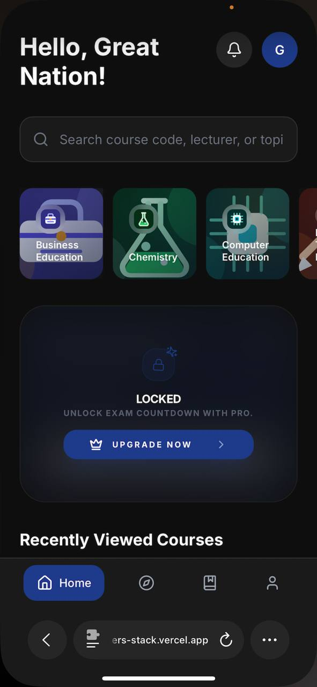
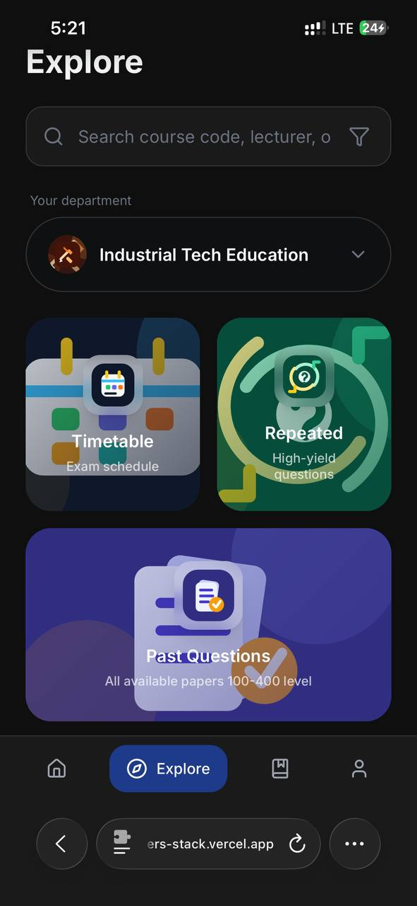
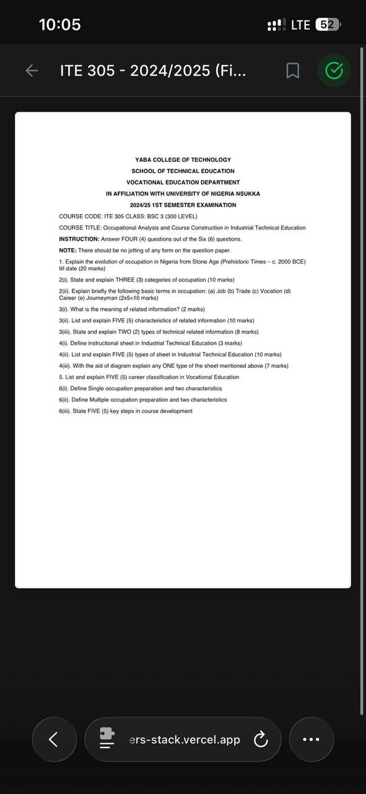
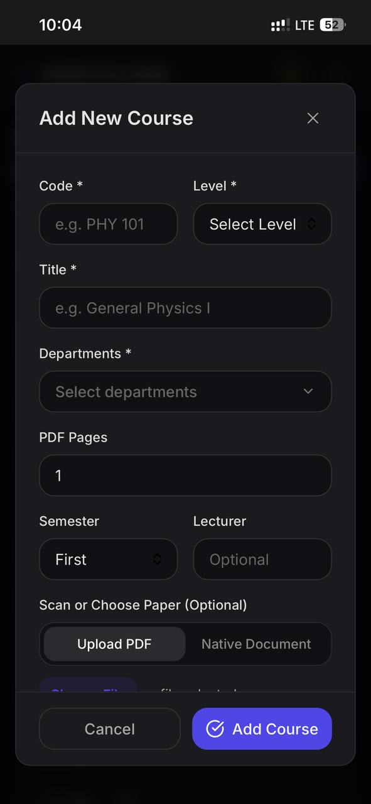
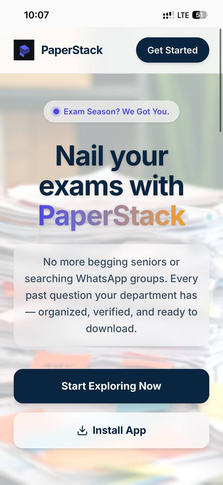

<p align="center">
  
</p>

<h1 align="center">PaperStack</h1>

<p align="center">
  An open-source academic resource platform that helps students organize, search, and access past questions and course materials.
</p>

<p align="center">
  <a href="https://paperstack.com.ng">Live Demo</a> · 
  <a href="#getting-started">Getting Started</a> · 
  <a href="CONTRIBUTING.md">Contributing</a> · 
  <a href="ROADMAP.md">Roadmap</a>
</p>

---

## The Problem

In many Nigerian universities, past examination questions are scattered, unreliable, and hard to find. Students rely on informal networks, blurry photocopies, and incomplete collections passed between classmates. There is no centralized, reliable, and accessible system for academic materials.

## The Solution

PaperStack is a Progressive Web App (PWA) that gives students a clean, fast, and organized way to browse, search, and download past questions and course materials — organized by department, course, level, and year. Administrators can upload and manage materials through a built-in admin dashboard.

## Key Features

- 📚 **Organized Course Library** — Browse past questions by department, level, course code, and year
- 🔍 **Search & Filter** — Find specific courses and materials quickly
- 📄 **Built-in PDF Viewer** — View documents directly in the app without downloading
- 🔖 **Bookmarks** — Save courses to your personal library for quick access
- 📲 **Progressive Web App** — Install on mobile and desktop, works offline
- 🔐 **Authentication** — Sign in with Google or email/password via Firebase Auth
- 🛡️ **Admin Dashboard** — Upload materials, manage courses, departments, users, and notifications
- 🔔 **Push Notifications** — Admins can send notifications to all users via Firebase Cloud Messaging
- 📊 **Analytics** — Admin-facing user growth analytics, signup charts, and engagement metrics
- 🎨 **Dark Mode UI** — Polished, mobile-first interface with smooth animations

## Tech Stack

| Layer | Technology |
|---|---|
| **Frontend** | React 18, TypeScript |
| **Build Tool** | Vite |
| **Styling** | Tailwind CSS 4 |
| **Backend** | Firebase (Authentication, Firestore, Storage) |
| **Push Notifications** | Firebase Cloud Messaging + Vercel Serverless Functions |
| **Animations** | Motion (Framer Motion) |
| **Icons** | Lucide React |
| **Routing** | React Router |
| **PWA** | vite-plugin-pwa |
| **Hosting** | Vercel |

## Screenshots







## Getting Started

### Prerequisites

- [Node.js](https://nodejs.org/) 18 or higher
- npm
- A [Firebase](https://firebase.google.com/) project with Authentication, Firestore, and Storage enabled

### Installation

1. **Clone the repository:**

```bash
git clone https://github.com/yourusername/paperstack.git
cd paperstack
```

2. **Install dependencies:**

```bash
npm install
```

3. **Set up environment variables:**

```bash
cp .env.example .env.local
```

Open `.env.local` and fill in your Firebase project credentials. See [Environment Variables](#environment-variables) below.

4. **Start the development server:**

```bash
npm run dev
```

The app will be available at `http://localhost:5173`.

### Building for Production

```bash
npm run build
```

## Environment Variables

Copy `.env.example` to `.env.local` and fill in your values. **Never commit `.env.local`.**

### Client Variables (used in the browser)

| Variable | Description |
|---|---|
| `VITE_FIREBASE_API_KEY` | Firebase API key |
| `VITE_FIREBASE_AUTH_DOMAIN` | Firebase Auth domain |
| `VITE_FIREBASE_PROJECT_ID` | Firebase project ID |
| `VITE_FIREBASE_STORAGE_BUCKET` | Firebase Storage bucket |
| `VITE_FIREBASE_MESSAGING_SENDER_ID` | Firebase Cloud Messaging sender ID |
| `VITE_FIREBASE_APP_ID` | Firebase app ID |
| `VITE_FIREBASE_VAPID_KEY` | VAPID key for push notifications |

These are public identifiers. App security is enforced by [Firebase Security Rules](https://firebase.google.com/docs/rules), not by keeping these values secret.

### Server Variables (used by Vercel serverless functions only)

| Variable | Description |
|---|---|
| `FB_SA_PROJECT_ID` | Firebase Admin SDK project ID |
| `FB_SA_CLIENT_EMAIL` | Firebase Admin SDK client email |
| `FB_SA_PRIVATE_KEY` | Firebase Admin SDK private key |

These are **secret** and must never be prefixed with `VITE_`. They are only used in `api/send-push.ts` via `process.env` and are never included in the browser bundle.

## Firebase Setup

1. Create a Firebase project at [console.firebase.google.com](https://console.firebase.google.com).
2. Enable **Authentication** (Google and Email/Password providers).
3. Create a **Firestore Database**.
4. Enable **Firebase Storage**.
5. Enable **Cloud Messaging** and generate a VAPID key pair.
6. Copy the Firebase config values into your `.env.local`.
7. Deploy the Firestore rules from `firestore.rules` and Storage rules from `storage.rules`.

For push notifications via the serverless function, generate a **Firebase Admin SDK private key** from Project Settings → Service Accounts and add the credentials to your Vercel environment variables.

## Available Scripts

| Command | Description |
|---|---|
| `npm run dev` | Start the development server |
| `npm run build` | Create an optimized production build |

## Project Structure

```
paperstack/
├── api/                        # Vercel serverless functions
│   └── send-push.ts            # Push notification dispatcher
├── public/                     # Static assets (icons, PWA manifest, service worker)
├── src/
│   ├── app/
│   │   ├── components/         # React components
│   │   │   ├── admin/          # Admin dashboard components
│   │   │   ├── ui/             # Reusable UI primitives
│   │   │   ├── Home.tsx        # Home screen
│   │   │   ├── Explore.tsx     # Course browsing
│   │   │   ├── Library.tsx     # Bookmarks
│   │   │   ├── Profile.tsx     # User profile
│   │   │   └── ...
│   │   ├── context/            # React context (AuthContext)
│   │   ├── cards/              # Route guards
│   │   └── App.tsx             # Main app with routing
│   ├── hooks/                  # Custom hooks and data layer
│   ├── lib/                    # Firebase client initialization
│   ├── services/               # Push notification service
│   ├── styles/                 # Global CSS
│   └── main.tsx                # App entry point
├── firestore.rules             # Firestore Security Rules
├── storage.rules               # Storage Security Rules
├── vite.config.ts              # Vite + PWA configuration
└── package.json
```

## Contributing

Contributions are welcome! Please read [CONTRIBUTING.md](CONTRIBUTING.md) for guidelines on how to get started, branch naming, pull request expectations, and important rules about not uploading copyrighted academic materials.

## Roadmap

See [ROADMAP.md](ROADMAP.md) for planned features and improvements.

## Security

To report a security vulnerability, please read [SECURITY.md](SECURITY.md). Do not open public issues for security concerns.

## License

This project is licensed under the MIT License. See [LICENSE](LICENSE) for details.

## Important Note

This repository contains only the PaperStack application source code. **Real academic materials, past questions, student data, and private Firebase data are not included.** Those are stored in Firebase and managed by authorized administrators. Contributors must not upload copyrighted or restricted academic content to this repository.

## Maintainer

**Babalola Samuel Obabiolorunkosi**

---

Built with ❤️ for students who deserve better access to academic resources.